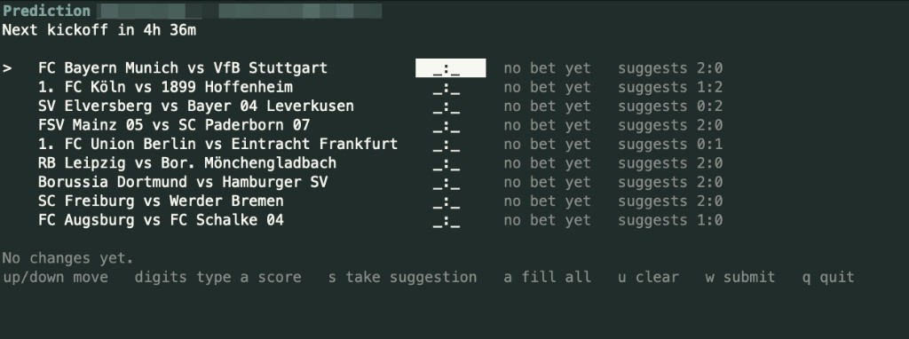

# kicktipp-agent

A helper for [Kicktipp](https://www.kicktipp.com) on **kicktipp.com** and **kicktipp.de**. You can check the table, place tips in a TUI (terminal UI), or ask Claude to do it in a chat.

Kicktipp has no public API, so this talks to the website from your own computer. Your password never leaves the machine. Do not type it into a chat.

## Start here

You only need one of the four sections below. Read the headings, pick the one that matches how you work, ignore the others.

| If you… | Go to |
|---------|--------|
| Chat with Claude as a desktop app | [Claude Desktop](#claude-desktop) |
| Use Claude in the terminal (Claude Code), or another MCP client | [Claude Code](#claude-code) |
| Want `kicktipp` commands in the terminal yourself | [The `kicktipp` command](#the-kicktipp-command) |
| Are editing this project's source | [Working on the code](#working-on-the-code) |

Every path needs [Node.js](https://nodejs.org/) 20 or newer. Open the site, click the big **LTS** button, run the installer, and leave the defaults. When it is done, open Terminal (macOS) or Command Prompt (Windows) and type:

```bash
node -v
```

You want a reply like `v20.19.0` or `v22.something`. If the computer says the command was not found, Node is not installed, or you need to close the terminal and open a new one so it picks up the installer.

Two ways to get the program itself:

- **npm** downloads the published package named `kicktipp-agent`. You do not keep a copy of this GitHub repo. This is the usual choice if you just want it to work.
- **This repo** means `git clone` of the source, then `npm install` and `npm run build` on your machine. Use this if you want the code in a folder you can open, or you are working from git rather than the registry.

### Claude Desktop

This is the least terminal-heavy path. After Node is installed, you can stay in the Claude app.

#### Install the Desktop file

This is a zip Claude Desktop knows how to install. It is the same Node program, with a settings form.

1. Download **[kicktipp.mcpb](https://github.com/christianheidorn/kicktipp-agent/releases/latest/download/kicktipp.mcpb)** from the latest [GitHub release](https://github.com/christianheidorn/kicktipp-agent/releases). The file version should match the release tag, for example both `1.1.0`.
2. Double-click the file. Claude Desktop should offer to install it. If nothing happens, open Claude Desktop and install the file from there.
3. Fill in the email and password you use on kicktipp.com or kicktipp.de. You can leave community blank and pick the pool later. Tick read-only if you only want Claude to look, not submit tips.
4. Fully quit Claude Desktop. Closing the window is not enough on a Mac. Use Claude → Quit, then open it again.
5. Start a **new** chat. Ask something like "What's my Kicktipp status?"

If Claude says it cannot find `node`, Node is missing from your PATH. Install LTS from nodejs.org, quit Desktop fully, try again.

#### Or use a clone of this repo

Same program, no `.mcpb` file. You clone the repo, build it, then tell Desktop to run `dist/server.js`. That needs a JSON edit. Step-by-step is under [Connecting Claude](#connecting-claude). Do not add the bundle *and* that JSON at the same time, or you will start two copies.

### Claude Code

Claude does not log into Kicktipp itself. It starts a small program on your computer. You attach that program once, then in a chat you tell it to set up your account. It will give you a link to `http://127.0.0.1:…` on your own machine. Open that in a normal browser, sign in, pick your pool. The password goes into that page, never into the chat.

#### From npm

This command downloads the `kicktipp-agent` package when needed and starts the MCP server. You do not have to clone anything.

```bash
claude mcp add kicktipp -- npx -y -p kicktipp-agent kicktipp-agent-mcp
```

The long name `kicktipp-agent-mcp` is the server binary. `kicktipp-mcp` is the same binary under a shorter name.

#### From this repo

You keep a folder with the source, compile it, then point Claude at that file. Run these from a terminal. The last line uses `pwd` so you do not have to type the folder path by hand. Run it while you are still inside `kicktipp-agent`.

```bash
git clone https://github.com/christianheidorn/kicktipp-agent.git
cd kicktipp-agent
npm install
npm run build
claude mcp add kicktipp -- node "$(pwd)/dist/server.js"
```

`npm install` fetches libraries. `npm run build` compiles TypeScript into `dist/`. On Windows, `$(pwd)` may not work. Use the full path to `dist\server.js` instead.

#### After either option

Open a **new** chat and say **Set up my Kicktipp account.** Open the local link, sign in, pick the community. After that, you can ask for status, the table, or to help with tips.

Editing Claude Desktop's config by hand is this same server. Details are in [Connecting Claude](#connecting-claude).

### The `kicktipp` command

This is for using Kicktipp from the terminal without an assistant. After it is installed you run `kicktipp login --web` once, then commands like `kicktipp today` and `kicktipp bet`.

#### From npm

This puts `kicktipp` on your PATH so it works in any terminal window:

```bash
npm install -g kicktipp-agent
kicktipp login --web
```

If you would rather not install globally, this runs the same login without `-g`:

```bash
npx -y -p kicktipp-agent kicktipp login --web
```

`-p kicktipp-agent` tells npx which package to download. The last `kicktipp` is the command inside that package.

#### From this repo

Clone, install libraries, compile, then `npm link` so the `kicktipp` command uses *this* folder's build:

```bash
git clone https://github.com/christianheidorn/kicktipp-agent.git
cd kicktipp-agent
npm install
npm run build
npm link
kicktipp login --web
```

#### After either option

`login --web` prints a `http://127.0.0.1:…/setup?token=…` link. On macOS and Linux it should open in your browser by itself. On Windows, copy that line into a browser if a window does not appear.

Sign in with your Kicktipp email and password, then pick your pool. After that:

```bash
kicktipp today
kicktipp bet
```

`today` lists today's matches. `bet` opens the TUI, a full-screen tip sheet, if you are in a real terminal.

### Working on the code

From a clone:

```bash
npm install
npm run build
npm test
```

`npm run pack:mcpb` builds the Desktop `.mcpb` file yourself. If you only want to *use* Desktop, download the file from [releases](https://github.com/christianheidorn/kicktipp-agent/releases) instead.

## CLI

### First-time setup

```bash
kicktipp login --web
```

That prints a `http://127.0.0.1:…/setup?token=…` link and opens it on macOS and Linux. On Windows, paste the link into a browser. Email and password go into that page, not into the terminal. After a successful Kicktipp login you pick a community. Credentials land in `~/.config/kicktipp-agent/config.ini` with mode 600.

`kicktipp login` without `--web` still prompts in the terminal, same as `set-community` on a first run.

Optionally set your player name so the leaderboard highlights your position:

```console
$ kicktipp set-player
```

### Commands

| Command | Description |
|---------|-------------|
| `login` | Connect an account (`--web` opens a localhost page) |
| `logout` | Remove stored credentials and session |
| `communities` | List all communities you belong to |
| `set-community` | Select a default community |
| `players` | List players in the saved community |
| `set-player` | Select which player you are |
| `set-notify` | Configure the `notify` backend (desktop, webhook, or command) |
| `leaderboard` | Show the matchday leaderboard |
| `overview` | Show the season overview |
| `schedule` | Show the match schedule |
| `table` | Show the league table |
| `bets` | Show your bets for a matchday |
| `bet` | Place bets. Opens the TUI on a real terminal, or by fixture / bonus |
| `today` | Show today's matches and which still need bets |
| `rules` | Show the game rules |
| `guide` | Print a detailed usage guide (useful for LLM agents) |
| `sync` | Download this season into the local cache |
| `cache status` / `cache clear` | Inspect or delete the cache |
| `stats` | Season analytics for you or another player |
| `rival` | What it would take to overtake another player |
| `suggest` | Bet slip suggested from the published odds |
| `scenario` | Project the leaderboard under hypothetical results |
| `whatif` | Replay the season under a different strategy |
| `deadline` | Time to kickoff and what still needs a bet |
| `remind` / `notify` | Reminder artifacts and notifications |
| `log` | What this agent submitted, and undo |
| `profiles` | List configured profiles |
| `admin` | Spielleiter tools (members, bets for a member) |

### The TUI (`kicktipp bet`)

On a real terminal, `kicktipp bet` with no arguments opens the TUI: a full-screen list of the matchday. Type scores in place, take the odds-based suggestion, submit with `w`.



Keys:

- arrows move
- digits type a score
- `s` take the suggestion on the current row
- `a` fill every empty row from suggestions
- `u` clear the current row
- `w` submit
- `q` quit without submitting

`kicktipp bet --no-tui` is the old one-match-at-a-time prompts. Bonus questions still use that path (`kicktipp bet --bonus`). You can also pass fixtures on the command line:

```bash
kicktipp bet "FC Bayern München vs Borussia Dortmund=2:1"
kicktipp bet "RB Leipzig vs Bayer 04 Leverkusen=0:0" --matchday 5
kicktipp bet --bonus "Who will win the league?=FC Bayern München"
```

### Options

- `--matchday <n>` — Target a specific matchday (1-34)
- `--bonus` — Bonus question rankings (with `leaderboard`) or bonus bets (with `bet`)
- `--view <value>` — Overview type (with `overview`)
- `--home` / `--away` — Home/away filter (with `table`)

### Analytics

Once a season is cached locally, the agent can answer questions Kicktipp
itself does not:

```bash
kicktipp sync                      # download this season into a local cache
kicktipp stats                     # your form, hit types, biases, consistency
kicktipp stats --player Papa       # or somebody else's
kicktipp rival Papa                # what has to happen for you to overtake them
kicktipp suggest --strategy ev     # a bet slip built from the published odds
```

`sync` walks the season once, pacing its requests, and skips matchdays it has
already stored, so later runs only fetch what is new. Everything downstream of
it reads the cache: `stats` needs no network at all, and `rival`/`suggest`
accept `--offline` to work the same way.

**stats** reports points per matchday against the league average, rank history,
how your hits break down (exact result / goal difference / tendency / miss),
how your predictions compare with what actually happened, and how consistent
you are. It always states how many matchdays the numbers rest on.

**rival** shows the points gap, how much each remaining match can still swing
it, and what would have to happen for you to pass someone. Kicktipp hides other
players' bets until the deadline passes, so before kickoff the answer is given
as best/worst bounds and labelled as such.

**suggest** converts the odds Kicktipp already prints into probabilities and
proposes a full slip, explaining every pick. Three strategies: `safe` backs the
likeliest outcome, `ev` maximises expected points under your community's own
scoring rules, and `contrarian` fades the favourite in close matches (high
variance on purpose). It prints and stops — submitting needs `--place`, which
asks first, and matches that already have a bet are left alone unless you pass
`--replace`.

This is odds arithmetic, not prediction magic: the numbers come from the
bookmaker's own prices, and no external data source or API key is involved.

The cache lives in your platform's data directory (`~/.local/share/kicktipp-agent`
on Linux) and can be inspected with `kicktipp cache status` or removed with
`kicktipp cache clear`.


### Deadlines and reminders

```bash
kicktipp deadline                  # countdown and what still needs a bet
kicktipp deadline --check          # exits 2 when something is due soon
kicktipp remind --print cron       # a crontab line built on that exit code
kicktipp remind --print systemd    # or user units; --install writes them
kicktipp remind --ics season.ics   # a calendar with an alarm per kickoff
kicktipp notify                    # notify now, if anything is urgent
```

The predict page in a browser shows kickoff times in *your* timezone.
Kicktipp's HTML does not: `.com` prints US Central (`8/28/26 1:30 PM`) and
`.de` prints Berlin (`28.08.26 20:30`) — the same instant, rewritten by
JavaScript on the page. The CLI reads the HTML, then shows the time in this
machine's zone (or `KICKTIPP_TZ` if you set one). Later rows that share a
kickoff have a blank date cell; that value is carried forward from the row
above.

A match is urgent when it still needs a bet and kickoff is within **6 hours**
(`--warn-hours`, or `KICKTIPP_WARN_HOURS`). Kicktipp closes betting at each
match's own kickoff, not at a matchday-wide deadline.

Notifications go through one backend, configured with `kicktipp set-notify`
(or the MCP `set_notify` tool). That writes `[notify]` in
`~/.config/kicktipp-agent/config.ini`:

```bash
kicktipp set-notify                  # picker
kicktipp set-notify desktop
kicktipp set-notify webhook https://ntfy.sh/your-topic
kicktipp set-notify command /usr/local/bin/my-hook
```

`desktop` is macOS Notification Center (or `notify-send` on Linux). `webhook`
POSTs JSON to the URL. `command` runs that program with the summary as an
argument and the deadline report on stdin. `KICKTIPP_NOTIFY_KIND` and
`KICKTIPP_NOTIFY_TARGET` override the file if set. There is no default
webhook endpoint — a URL only ever goes where you named it.

### Scenarios, replays and the bet log

```bash
kicktipp scenario "Bayern vs BVB=2:1"     # project the table
kicktipp scenario --target 1              # what would put you first
kicktipp whatif "2:1"                     # replay the season on a fixed bet
kicktipp whatif suggest:ev
kicktipp log                              # what the agent submitted
kicktipp log --undo                       # put the previous bets back
```

Every submission — CLI, TUI, suggestion or MCP — is appended to a local
JSONL log with the bet it replaced, which is what makes `--undo` possible and
what lets you audit an assistant after the fact.

### Multiple pools and accounts

```bash
kicktipp -c other-pool schedule     # one-off, without changing the default
kicktipp -p work stats              # a separate account and session
kicktipp profiles
```

A profile is a `[profile.<name>]` section with its own account, community and
player. Configs without profiles keep working exactly as before.

### Spielleiter tools

If you run a community, `kicktipp admin members`, `admin bets <member>` and
`admin bet <member> "Home vs Away=H:G"` fill in bets for members who have no
login of their own. Placing for someone else asks you to type their name back
first, and refuses outright if the page would not carry their id.

### Scoring rules

Features that count points read your community's rules page to learn what an
exact result, a goal difference and a tendency are worth, and whether any
matchday counts double. If that page cannot be parsed, Kicktipp's 4/3/2
defaults are assumed and every affected output says so. You can also set the
values explicitly:

```ini
[scoring]
exact = 4
diff = 3
tendency = 2
```

To find out whether the values are actually right:

```bash
kicktipp rules --verify        # recompute a finished matchday and compare
```

This recomputes every player's score for a finished matchday and checks it
against the numbers Kicktipp itself reported — the only real proof the model
matches the community. It exits 1 on a mismatch.

## Connecting Claude

Claude does not talk to Kicktipp itself. It starts a small program on your computer. That program logs into kicktipp.com or kicktipp.de. The assistant sees pool data. It never sees your password.

If you only wanted it working, [Start here](#start-here) is enough. The rest of this section is the detail.

The `.mcpb` file is that program, zipped, with a recipe for Claude Desktop. It is not a remote server. Each GitHub release includes one, tagged with the same version as `package.json`.

Pick **one** Desktop path. Running the bundle and a manual config at the same time starts two copies.

### After you connect the assistant

Wiring Claude to this server is not the same as signing into Kicktipp. Unless you already ran `kicktipp login` or filled in the Desktop bundle's email and password, open a new chat and tell the assistant to set up your Kicktipp account. It should call `connect_account` and give you a `http://127.0.0.1:…/setup?token=…` link. Open that, sign in, pick a community. Do not paste the password into the chat.

`get_status` returns the same link when nothing is saved yet. So does any tool that needs a login.

```bash
kicktipp login --web
```

is the CLI equivalent, if you prefer to sign in before connecting any assistant.

### Claude Desktop, by hand

Settings → Developer → Edit config opens `~/Library/Application Support/Claude/claude_desktop_config.json` on a Mac. Add this under `mcpServers`, then fully quit and reopen Desktop:

```json
"kicktipp": {
  "command": "node",
  "args": [
    "/absolute/path/to/kicktipp-agent/dist/server.js"
  ]
}
```

No `env` block. The program reads `config.ini`. Build first (`npm run build`). After a `git pull` that changes the server, build again or Desktop keeps using the old `dist`.

In a new chat, tell the assistant to set up Kicktipp unless you already signed in. Then ask for status.

### Claude Desktop, the bundle

A packed `kicktipp.mcpb` is attached to every [GitHub release](https://github.com/christianheidorn/kicktipp-agent/releases). Download it from the latest release:

**[kicktipp.mcpb](https://github.com/christianheidorn/kicktipp-agent/releases/latest/download/kicktipp.mcpb)**

Double-click that file, or install it from Claude Desktop. Desktop shows a settings form: email, password, optional community slug, read-only. The password goes in the OS keychain and is passed to the local process as env. Quit and reopen Desktop.

If you already signed in another way, the manual config above is simpler than filling that form.

Packing it yourself from a checkout is optional. The release asset is the one to download:

```bash
npm run pack:mcpb
```

That writes `kicktipp.mcpb` in the repo root, with the version from `package.json`.

Turn the extension off if you also added the JSON snippet, so only one server runs.

### Claude Code

**npm**

```bash
claude mcp add kicktipp -- npx -y -p kicktipp-agent kicktipp-agent-mcp
```

**This repo**, after `npm install` and `npm run build`. Replace the path.

```bash
claude mcp add kicktipp -- node /absolute/path/to/kicktipp-agent/dist/server.js
```

Start a new chat. If Kicktipp is not signed in yet, tell the assistant to set up your account. Otherwise ask for Kicktipp status.

### Session-only storage

The setup page has a checkbox to keep the login cookie and drop the password (`store = session` under `[auth]`). A leaked config then has no Kicktipp password, and you can revoke the cookie on the Kicktipp site. When Kicktipp expires the session, this tool cannot log in again by itself. Tools return a fresh setup link instead. Opt-in, not the default.

### Environment variables

An `env` block in the client config still works and wins over the file. Use it only when a client cannot use the setup page or Desktop's settings form. The password then sits in that client's config:

```json
{
  "mcpServers": {
    "kicktipp": {
      "command": "node",
      "args": ["/absolute/path/to/kicktipp-agent/dist/server.js"],
      "env": {
        "KICKTIPP_EMAIL": "you@example.com",
        "KICKTIPP_PASSWORD": "yourpassword"
      }
    }
  }
}
```

### Available tools

| Tool | Description |
|------|-------------|
| `get_status` | Check if credentials and community are configured |
| `connect_account` | Open the localhost setup page (for "set up kicktipp" / reconnect) |
| `get_today_matches` | Today's matches with bet status |
| `get_bets` | Matches and current bets for a matchday |
| `get_schedule` | Match schedule with results |
| `get_leaderboard` | Player rankings for a matchday |
| `get_overview` | Season overview across all matchdays |
| `get_table` | League table (actual football standings) |
| `get_rules` | Game rules and scoring system |
| `get_communities` | List communities the user belongs to |
| `get_players` | List players in the community |
| `get_bonus_questions` | Bonus questions with options |
| `set_community` | Set the active community |
| `set_player` | Set which player you are |
| `place_bets` | Place match bets by fixture name |
| `place_bonus_bets` | Place bonus question answers |
| `sync_history` | Fill the local cache so the analytics tools have data |
| `get_stats` | Season analytics for a player |
| `get_rival_analysis` | Gap, swing and overtake conditions vs. another player |
| `suggest_bets` | Suggested bet slip from the odds (read-only, never submits) |
| `get_deadline` | Countdown and which matches still need a bet |
| `get_standings_scenarios` | Project the table under hypothetical results |
| `whatif` | Replay the season under a different strategy |
| `get_bet_log` | What this agent submitted, from the record |
| `list_members` / `get_bets_for_member` / `place_bets_for_member` | Spielleiter tools |

### Read-only mode

For a connection that provably cannot bet, check read-only on the setup page, set `read_only = true` under `[server]`, or set `KICKTIPP_READ_ONLY=1` in an `env` block. Betting and settings tools are then never registered, so they do not appear in the tool list at all, and the submitting functions refuse independently. This is the recommended way to try the MCP server for the first time.

### kicktipp.com and kicktipp.de

Both sites work. The default is `https://www.kicktipp.com`. If a page is missing there, the same page is tried on kicktipp.de (and the other way around), including German and English URL spellings. You usually do not have to pick.

To start on the German site on purpose, set `KICKTIPP_BASE_URL=https://www.kicktipp.de`.

## Changelog

See [CHANGELOG.md](CHANGELOG.md).

## Development

```bash
npm test          # run tests
npm run build     # compile TypeScript
npm run pack:mcpb # zip dist + production deps into kicktipp.mcpb
```

## Credits

Originally forked from [schwalle/kicktipp-betbot](https://github.com/schwalle/kicktipp-betbot) by Stefan. The project has since been fully rewritten in TypeScript with a new CLI interface, MCP server, and Cheerio-based parsing.
